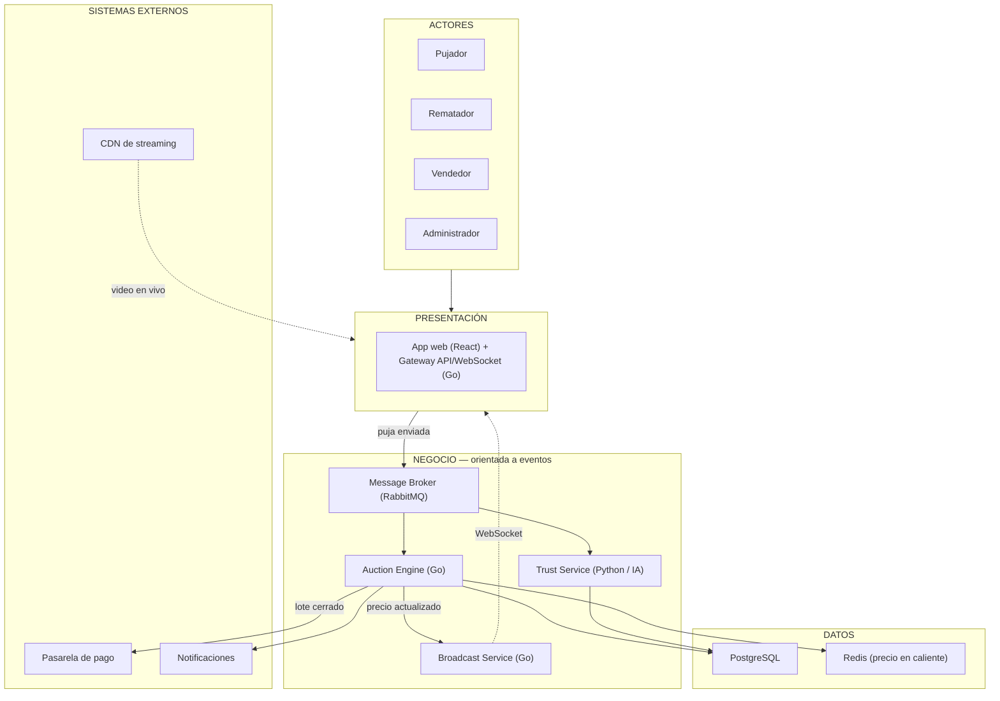

# Arquitectura inicial del sistema — LiveBid

## De 3 capas a "capas + orientada a eventos"

El ejemplo de la guía organiza el sistema en tres capas puras: Presentación → Lógica de negocio → Datos, con llamadas síncronas de arriba hacia abajo. Los drivers arquitectónicos **DA01** (1,000+ usuarios concurrentes), **DA02** (orden verificable de pujas) y **DA06** (filtro de fraude en el camino crítico) hacen que ese modelo puro no alcance para representar el sistema con honestidad: la capa de negocio no es un solo bloque que responde llamadas una por una, sino un conjunto de servicios independientes que se comunican de forma asíncrona a través de un **message broker**.

Por eso mantenemos las mismas tres preguntas que la guía usa para justificar cada capa, pero la capa de negocio se subdivide en servicios conectados por eventos en lugar de una sola responsabilidad monolítica.

| Capa | Pregunta que responde |
|---|---|
| Presentación | ¿Cómo interactúa el usuario? |
| Negocio (orientada a eventos) | ¿Qué hace el sistema, y en qué orden lo garantiza? |
| Datos | ¿Dónde se almacena la información? |
| Sistemas externos | ¿Con qué depende el sistema que no controla directamente? |

## Diagrama de arquitectura

## Responsabilidades por capa

- **Presentación**: la app web muestra el catálogo de subastas, embebe el video del CDN y envía cada puja al gateway; el gateway autentica y valida el formato antes de publicar el evento al broker — no conoce reglas de negocio.
- **Negocio (orientada a eventos)**:
  - *Message Broker*: encola cada puja y garantiza su orden dentro de la subasta correspondiente.
  - *Auction Engine*: consume la cola, valida la puja contra el precio actual y el incremento mínimo, y decide si se acepta.
  - *Trust Service*: consume el mismo evento en paralelo y calcula el puntaje de confianza del pujador antes de que la puja se dé por válida.
  - *Broadcast Service*: toma el resultado del Auction Engine y lo empuja por WebSocket a todos los espectadores conectados.
- **Datos**: PostgreSQL guarda el registro transaccional (usuarios, subastas, pujas, pagos); Redis mantiene el precio actual en memoria para lecturas rápidas sin golpear la base de datos en cada consulta.
- **Sistemas externos**: la pasarela de pago se activa solo al cerrar un lote; el CDN entrega el video directamente a la app del espectador, sin pasar por el backend propio; las notificaciones avisan resultados fuera de la sesión activa.

## Qué se mantiene igual respecto al modelo de 3 capas

La dirección general del flujo (de afuera hacia adentro, y de la lógica hacia los datos) se conserva. Lo que cambia es que, dentro de la capa de negocio, la comunicación es asíncrona y con más de un consumidor por evento — una decisión que no se puede tomar recién en la etapa de implementación, porque afecta directamente cómo se van a escribir las especificaciones de cada servicio en la Etapa 3 (Spec-Driven Development).

## Diagrama interactivo (Archify)

Para una versión interactiva con zoom, búsqueda, trazado de relaciones y vistas guiadas, consultar:

- **HTML explorable:** [livebid-arquitectura.html](livebid-arquitectura.html)
- **Especificación JSON:** [livebid-arquitectura.architecture.json](livebid-arquitectura.architecture.json)
