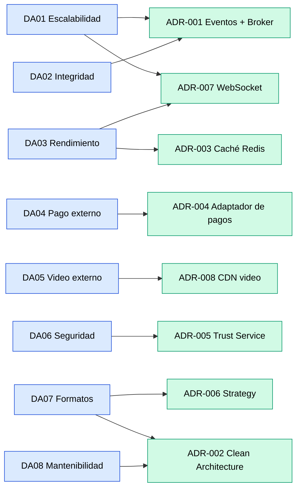

# Decisiones arquitectónicas (ADR) — LiveBid

## ¿Qué es un ADR?

Un **ADR (Architecture Decision Record)** documenta las decisiones importantes que se toman durante el diseño de la arquitectura del software, junto con su justificación y el resultado esperado.

## Registro de decisiones

| ID | Decisión arquitectónica | Driver relacionado | Justificación | Resultado |
|---|---|---|---|---|
| ADR-001 | Arquitectura orientada a eventos con message broker | DA01 — Escalabilidad; DA02 — Integridad | Organizar la comunicación entre servicios mediante colas de mensajes para soportar alta concurrencia y garantizar el orden de las pujas. | RabbitMQ como broker central con cola dedicada por subasta activa. |
| ADR-002 | Clean / Hexagonal Architecture por servicio | DA08 — Mantenibilidad; DA07 — Formatos | Separar las reglas del negocio de los detalles tecnológicos para facilitar el mantenimiento, las pruebas y la evolución de cada servicio. | Cada servicio organizado en capas: Dominio, Aplicación, Infraestructura y Presentación (puertos y adaptadores). |
| ADR-003 | Estrategia de caché con Redis | DA03 — Rendimiento | Reducir la latencia en la consulta del precio actual del lote, evitando golpear PostgreSQL en cada puja. | Redis almacena el precio en caliente; PostgreSQL mantiene el registro transaccional completo. |
| ADR-004 | Integración de pagos mediante interfaces y adaptadores | DA04 — Pago externo | Desacoplar los casos de uso del proveedor de pagos para poder cambiar de Stripe a PayPal (u otro) sin modificar la lógica de negocio. | Interfaz `PaymentGateway` en la capa de dominio; adaptador concreto (`StripeAdapter`) en infraestructura. |
| ADR-005 | Trust Service como filtro de fraude en el camino crítico | DA06 — Seguridad | Insertar un servicio de evaluación de confianza que analice cada puja antes de que el Auction Engine la acepte, para prevenir fraude. | Trust Service consume eventos del broker en paralelo y calcula un trust score por pujador. |
| ADR-006 | Patrón Strategy para formatos de subasta | DA07 — Formatos | Soportar múltiples formatos (ascendente, descendente, sellada, benéfica) sin lógica condicional acoplada. | Interfaz `AuctionFormat` con implementaciones concretas por formato; el Auction Engine delega la validación de reglas al strategy correspondiente. |
| ADR-007 | WebSocket para difusión en tiempo real | DA03 — Rendimiento; DA01 — Escalabilidad | La actualización del precio debe llegar a todos los espectadores en menos de 1 segundo tras una puja válida. HTTP polling no cumple este requisito. | Broadcast Service empuja eventos por WebSocket a todos los clientes conectados a la subasta. |
| ADR-008 | Video delegado a CDN externo | DA05 — Video externo | La distribución de video en vivo no debe pasar por el backend propio para evitar cuellos de botella y aprovechar la infraestructura especializada de un CDN. | CDN (Cloudflare Stream / Mux / AWS IVS) entrega el video directamente al navegador; el backend solo gestiona el "canal de precio". |

## Diagrama de relación: Drivers → ADRs

